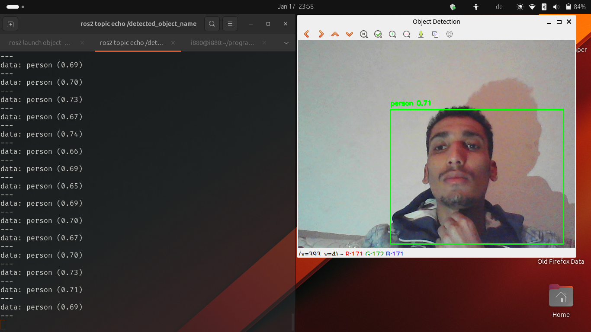

---

# **ROS 2 Object Detection with YOLOv3** 🚀

Welcome to the **ROS 2 Object Detection** project! This repository demonstrates how to perform real-time object detection using **YOLOv3** in a **ROS 2** environment. Whether you're a robotics enthusiast, a computer vision developer, or just curious about AI-powered object detection, this project is for you!

---

## **Features** ✨

- **Real-Time Object Detection**: Detect objects in real-time using a camera feed.
- **YOLOv3 Integration**: Leverage the power of YOLOv3, a proven and reliable object detection model.
- **ROS 2 Compatibility**: Seamlessly integrate object detection into your ROS 2 workflows.
- **Customizable**: Easily adapt the code to detect custom objects or use different YOLO models.
- **Visualization**: Display bounding boxes and labels directly on the camera feed.

---

## **Demo** 🎥

  

---

## **Getting Started** 🛠️

### **Prerequisites**
Before you begin, ensure you have the following installed:
- **ROS 2** (tested on Jazzy Jalisco)
- **Python 3.8+**
- **OpenCV**
- **Darknet YOLOv3** (pre-trained weights and configuration files included)

### **Installation**
1. Clone the repository:
   ```bash
   git clone https://github.com/i880/object_detection_ros2.git
   cd object_detection_ros2
   ```

2. Install dependencies:
   ```bash
   pip install opencv-python
   ```

3. Build the ROS 2 package:
   ```bash
   colcon build --packages-select object_detection_ros2
   source install/setup.bash
   ```

---

## **Usage** 🚦

1. **Run the Object Detection Node**:
   Launch the object detection node:
   ```bash
   ros2 launch object_detection_ros2 object_detection.launch.py
   ```

2. **View the Results**:
   - The detected objects will be displayed in a live camera feed.
   - The names of detected objects are published to the `/detected_object_name` topic.

3. **Customize the Model**:
   Replace the default YOLOv3 model (`yolov3-tiny.weights` and `yolov3-tiny.cfg`) with your custom-trained model:
   ```python
   self.net = cv2.dnn.readNet("path/to/your/weights.weights", "path/to/your/config.cfg")
   ```

---

## **Project Structure** 📂

```
object_detection_ros2/
├── launch/                  # ROS 2 launch files
│   └── object_detection.launch.py
├── models/                  # YOLO model files
│   ├── yolov3-tiny.weights  # Pre-trained YOLOv3 weights
│   ├── yolov3-tiny.cfg      # YOLOv3 configuration file
│   ├── coco.names           # COCO class labels
├── object_detection_ros2/   # ROS 2 package source code
│   ├── camera_node.py       # Camera feed publisher
│   ├── object_detection_node.py  # Object detection node
│   └── __init__.py
├── README.md                # This file
├── setup.py                 # ROS 2 package setup
└── package.xml              # ROS 2 package metadata
```

---

## **Contributing** 🤝

We welcome contributions! If you'd like to improve this project, please follow these steps:
1. Fork the repository.
2. Create a new branch (`git checkout -b feature/YourFeature`).
3. Commit your changes (`git commit -m 'Add some feature'`).
4. Push to the branch (`git push origin feature/YourFeature`).
5. Open a pull request.

---

## **License** 📜

This project is licensed under the **MIT License**. See the [LICENSE](LICENSE) file for details.

---

## **Acknowledgments** 🙏

- **Joseph Redmon** for the original YOLO (You Only Look Once) algorithm.
- **ROS 2** for providing a robust framework for robotics development.
- **OpenCV** for making computer vision accessible to everyone.

---

## **Contact** 📧

Have questions or suggestions? Feel free to reach out:
- **GitHub**: [i880](https://github.com/i880)
- **Email**: ibrahimjebar255@gmail.com

---

## **Star This Repo** ⭐

If you find this project useful, please give it a star! It helps others discover the project and motivates us to keep improving it.

---

Happy coding! 🚀  
**i880**

---

### **Key Changes for YOLOv3**
1. **Features**: Updated to highlight YOLOv3 instead of YOLOv8.
2. **Prerequisites**: Removed `ultralytics` and added Darknet YOLOv3.
3. **Usage**: Updated instructions for using YOLOv3 weights and configuration files.
4. **Project Structure**: Updated to reflect YOLOv3 model files (`yolov3-tiny.weights`, `yolov3-tiny.cfg`, `coco.names`).

---

